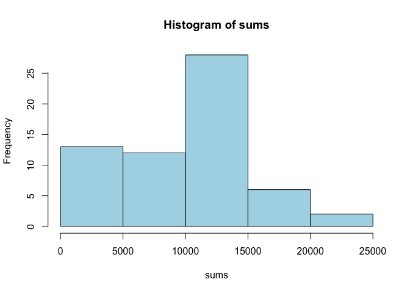
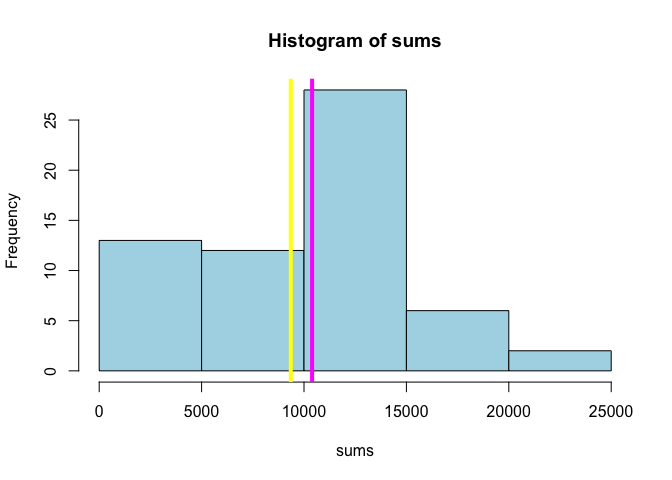
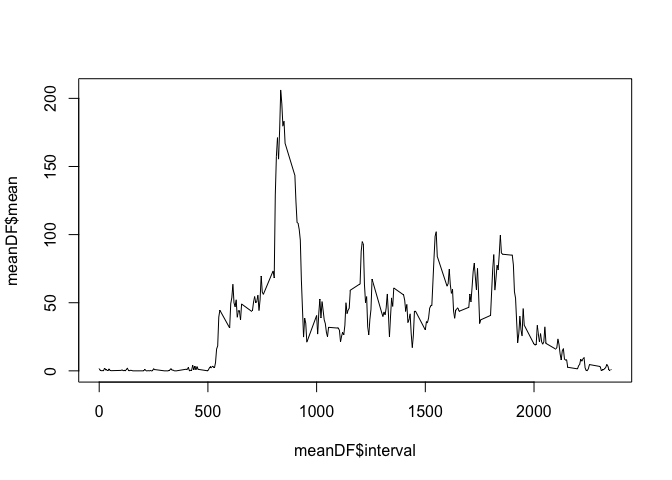
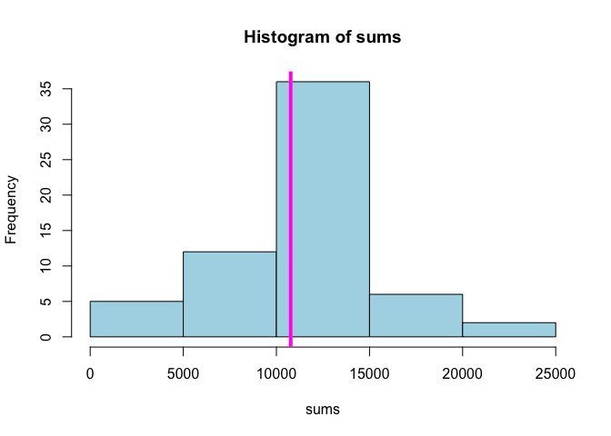
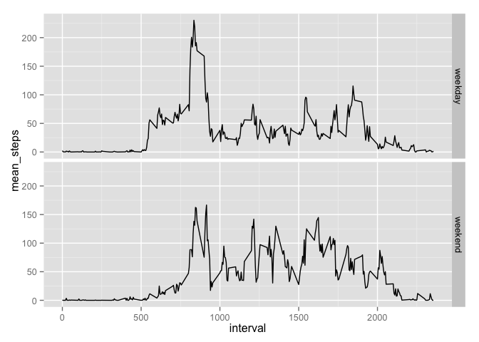

# Reproducible Research: Peer Assessment 1


## Loading and preprocessing the data


```r
setwd("~/RepData_PeerAssessment1")
unzip("activity.zip")
acts<-read.csv("activity.csv")
library(dplyr)
```

```
## 
## Attaching package: 'dplyr'
## 
## The following object is masked from 'package:stats':
## 
##     filter
## 
## The following objects are masked from 'package:base':
## 
##     intersect, setdiff, setequal, union
```

```r
library(ggplot2)
```

## What is mean total number of steps taken per day?
calculate total number of steps taken per day

```r
sums<-tapply(acts$steps,acts$date,sum,na.rm=TRUE)
```

plot the histgram of total number of steps taken per day

```r
hist(sums,col="light blue")
```

 

calculate mean and median 

```r
sum_med<-median(sums)
sum_mean<-mean(sums)
hist(sums,col="light blue")
abline(v=sum_mean,col="yellow",lwd=4)
abline(v=sum_med,col="magenta",lwd=4)
```

 

mean of the total number os steps per day is 9354.2295082, shown in yellow line   
median of the total number os steps per day is 10395, shown in magenta line


## What is the average daily activity pattern?

showing the average daily pattern

```r
##interval_mean<-tapply(acts$steps,acts$interval,mean,na.rm=TRUE)
meanDF<-aggregate(acts[,"steps"],list(interval=acts[,"interval"]),mean,na.rm=TRUE)
meanDF$interval<-as.numeric(as.character(meanDF$interval))
meanDF<-rename(meanDF,mean=x)
plot(meanDF$interval,meanDF$mean,type="l")
```

 

maximun average step

```r
meanDF[meanDF$mean==max(meanDF$mean),]
```

```
##     interval     mean
## 104      835 206.1698
```


## Imputing missing values

reporting the number of missing data, and the percentage

```r
summary(acts$steps)
```

```
##    Min. 1st Qu.  Median    Mean 3rd Qu.    Max.    NA's 
##    0.00    0.00    0.00   37.38   12.00  806.00    2304
```

```r
mean(is.na(acts$steps))
```

```
## [1] 0.1311475
```


impute missing values with mean of the interval

```r
missing<-is.na(acts$steps)
acts1<-acts[!missing,]
acts0<-acts[missing,]
mdata<-merge(acts0,meanDF)
mdata$steps<-mdata$mean
mdata<-mdata[,1:3]
nacts<-rbind(acts1,mdata)
summary(nacts$steps)
```

```
##    Min. 1st Qu.  Median    Mean 3rd Qu.    Max. 
##    0.00    0.00    0.00   37.38   27.00  806.00
```

calculate total number of steps per day, mean and median and plot them

```r
sums<-tapply(nacts$steps,nacts$date,sum)
sum_med<-median(sums)
sum_mean<-mean(sums)
hist(sums,col="light blue")
abline(v=sum_mean,col="yellow",lwd=4)
abline(v=sum_med,col="magenta",lwd=4)
```

 
mean of the total number os steps per day is 1.0766189\times 10^{4}, shown in yellow line   
median of the total number os steps per day is 1.0766189\times 10^{4}, shown in magenta line


## Are there differences in activity patterns between weekdays and weekends?

add one variable daytype indicating weekday or weekend

```r
nacts$date<-as.Date(nacts$date)
nacts$day<-weekdays(nacts$date)
nacts<-mutate(nacts,daytype=factor(1*(day=="Sunday"| day=="Saturday"),labels=c("weekday","weekend")))
```

calculate and plot the average steps 

```r
nmeanDF<-aggregate(nacts[,"steps"],list(interval=nacts[,"interval"],daytype=nacts[,"daytype"]),mean)
nmeanDF<-rename(nmeanDF,mean_steps=x)
qplot(interval,mean_steps,data=nmeanDF,facets=daytype~.,geom="line")
```

 
